---
## Front matter
title: "Отчет по лабораторной работе №3"
subtitle: "Простейший вариант"
author: "Кристина Андреевна Барабанова"

## Generic otions
lang: ru-RU
toc-title: "Содержание"

## Bibliography
bibliography: bib/cite.bib
csl: pandoc/csl/gost-r-7-0-5-2008-numeric.csl

## Pdf output format
toc: true # Table of contents
toc-depth: 2
lof: true # List of figures
lot: true # List of tables
fontsize: 12pt
linestretch: 1.5
papersize: a4
documentclass: scrreprt
## I18n polyglossia
polyglossia-lang:
  name: russian
  options:
	- spelling=modern
	- babelshorthands=true
polyglossia-otherlangs:
  name: english
## I18n babel
babel-lang: russian
babel-otherlangs: english
## Fonts
mainfont: PT Serif
romanfont: PT Serif
sansfont: PT Sans
monofont: PT Mono
mainfontoptions: Ligatures=TeX
romanfontoptions: Ligatures=TeX
sansfontoptions: Ligatures=TeX,Scale=MatchLowercase
monofontoptions: Scale=MatchLowercase,Scale=0.9
## Biblatex
biblatex: true
biblio-style: "gost-numeric"
biblatexoptions:
  - parentracker=true
  - backend=biber
  - hyperref=auto
  - language=auto
  - autolang=other*
  - citestyle=gost-numeric
## Pandoc-crossref LaTeX customization
figureTitle: "Рис."
tableTitle: "Таблица"
listingTitle: "Листинг"
lofTitle: "Список иллюстраций"
lotTitle: "Список таблиц"
lolTitle: "Листинги"
## Misc options
indent: true
header-includes:
  - \usepackage{indentfirst}
  - \usepackage{float} # keep figures where there are in the text
  - \floatplacement{figure}{H} # keep figures where there are in the text
---

# Цель работы

Изучить идеологию и применение средств контроля версий. Приобрести
практические навыки по работе с системой git.

# Выполнение лабораторной работы

1. Настройка github
Создала учётную запись на сайте https://github.com/ и заполнила основные
данные. (рис. [-@fig:001])

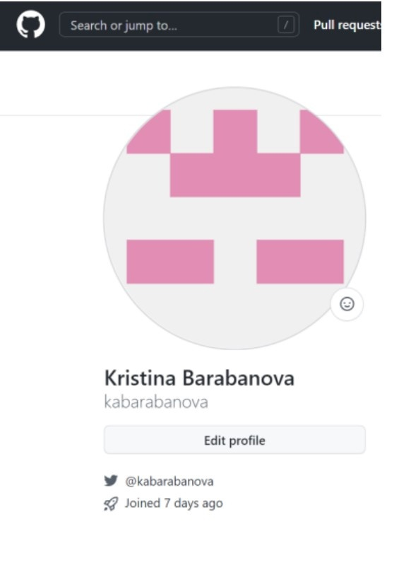{ #fig:001 width=70% }

2. Базовая настройка git
Сделала предварительную конфигурацию git. Открыла терминал и ввела
следующие команды, указав имя и email git config --global user.name ""
git
config
--global
user.email
"".
Далее настроила utf-8 в выводе сообщений с помощью команды git
config
--global
core.quotepath
false.Затем задала имя начальной ветки: git config --global init.defaultBranch
master.
Затем параметры autocrlf и safecrlf. (рис. [-@fig:002])

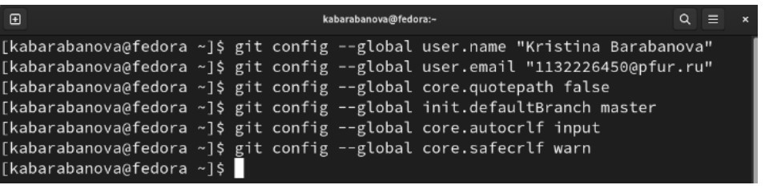{ #fig:002 width=70% }

3. Создание SSH ключа
Сгенерировала пару ключей для последующей идентификации пользователя на сервере репозиториев с помощью команды ssh-keygen -C. (рис. [-@fig:003])

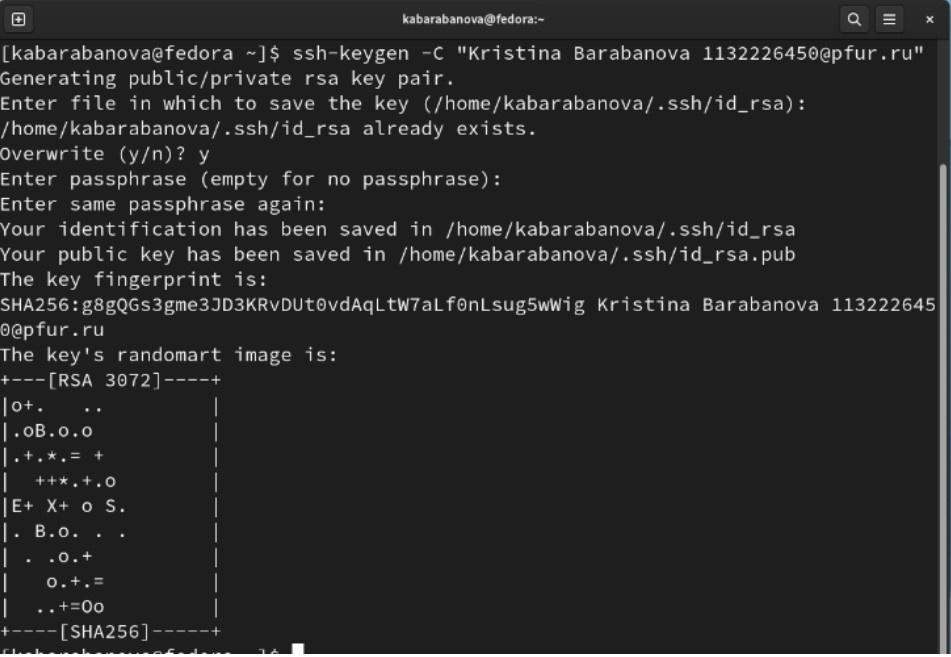{ #fig:003 width=70% }

Далее скопировала ключ с помощью команды cat ~/.ssh/id_rsa.pub | xclip
-sel clip. (рис. [-@fig:004])

{ #fig:004 width=70% }

Затем вставила ключ из буфера обмена в появившееся поле на сайте ивписала имя ключа (рис. [-@fig:005])

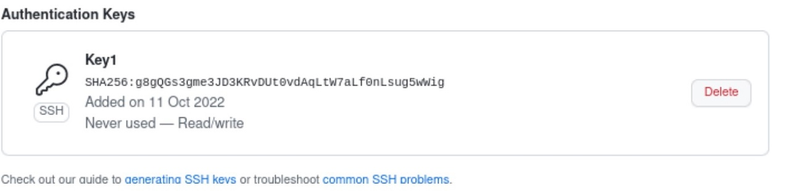{ #fig:005 width=70% }

4. Создание рабочего пространства и репозитория курса на основе
шаблона
В терминале создала каталог для предмета «Архитектура компьютера»
с помощью команды mkdir -p ~/work/study/2022-2023/"Архитектура
компьютера" (рис. [-@fig:006])

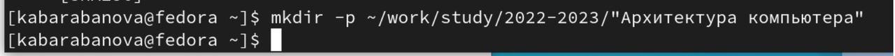{ #fig:006 width=70% }

5. Создание репозитория курса на основе шаблона
Перешла на станицу репозитория с шаблоном курса
https://github.com/yamadharma/course-directory-student-template. Далее
выбрала Use this template. (рис. [-@fig:007])

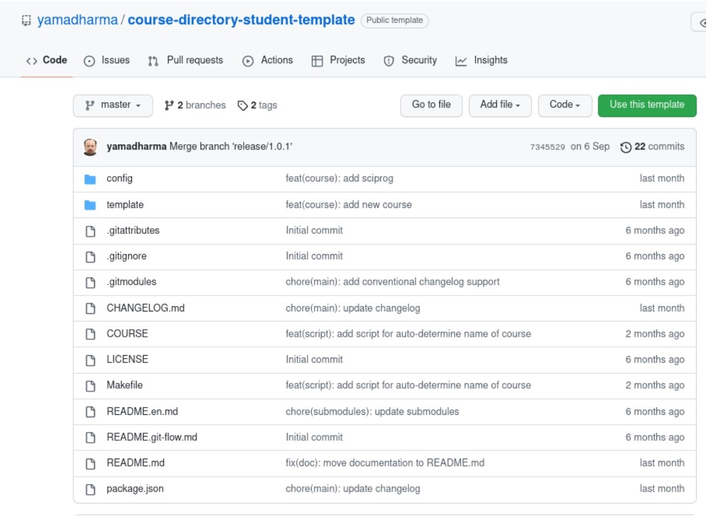{ #fig:007 width=70% }

В открывшемся окне задала имя репозитория study_2022–2023_arh-pc и
создала репозиторий. (рис. [-@fig:008])

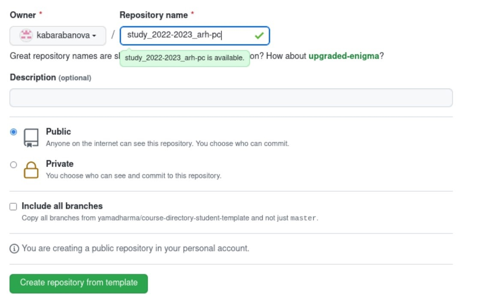{ #fig:008 width=70% }

В терминале перешла в каталог курса с помощью команды: cd
~/work/study/2022-2023/"Архитектура компьютера" (рис. [-@fig:009])

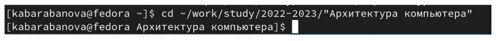{ #fig:009 width=70% }

Далее клонировала созданный репозиторий (рис. [-@fig:010])

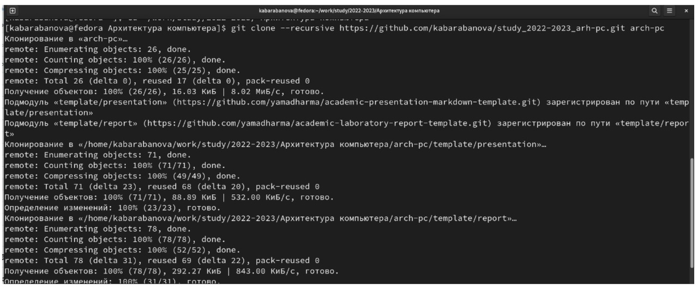{ #fig:010 width=70% }

6. Настройка каталога курса
Перешла в каталог курса с помощью команды cd ~/work/study/2022-
2023/"Архитектура компьютера"/arch-pc.
Удалила лишние файлы: rm package.json
Создала необходимые каталоги: echo arch-pc > COURSE , make
Отправила файлы на сервер: git add . git commit -am 'feat(main): make
course structure' , git push (рис. [-@fig:011]), (рис. [-@fig:012])

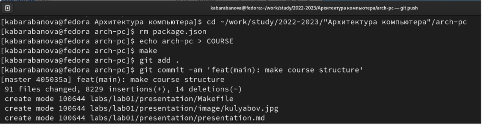{ #fig:011 width=70% }

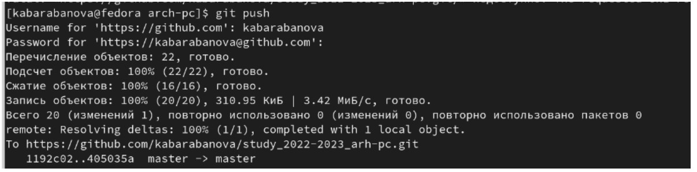{ #fig:012 width=70% }

Проверила правильность создания иерархии рабочего пространства в
локальном репозитории (рис. [-@fig:013]) и на странице github (рис. [-@fig:014]).

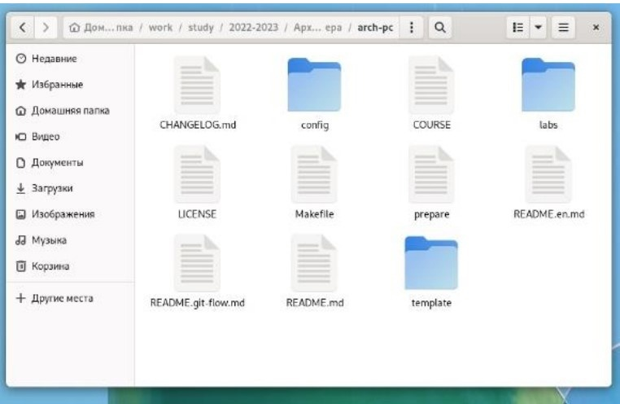{ #fig:013 width=70% }

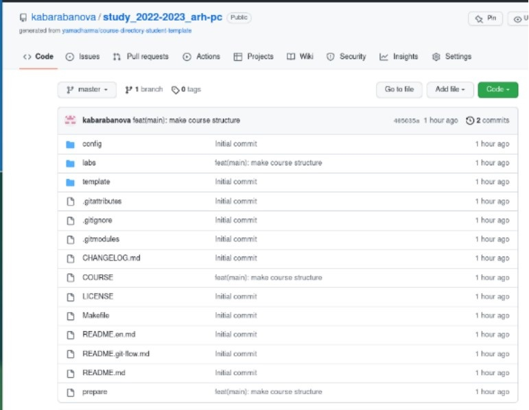{ #fig:014 width=70% }

7. Задания для самостоятельной работы
Создайте отчет по выполнению лабораторной работы в
соответствующем каталоге рабочего пространства (labs>lab03>report).
Скопируйте отчеты по выполнению предыдущих лабораторных работ в
соответствующие каталоги созданного рабочего пространства и
загрузите файлы на github (рис. [-@fig:015]), (рис. [-@fig:016])

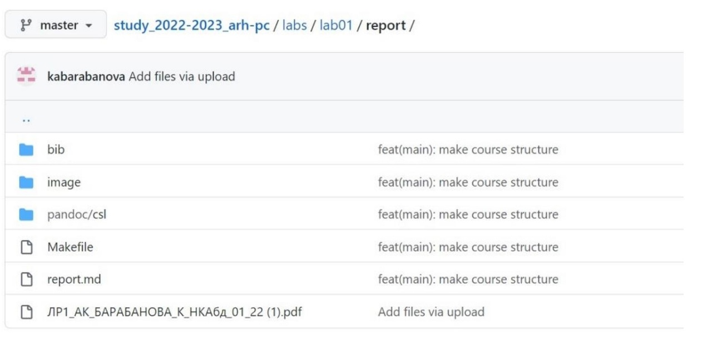{ #fig:015 width=70% }

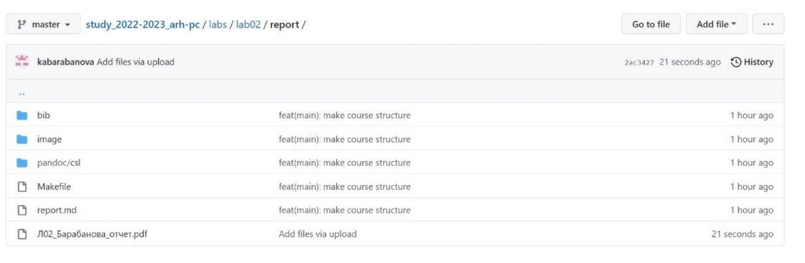{ #fig:016 width=70% }

Ссылка на github: kabarabanova/study_2022-2023_arh-pc

# Выводы

Я изучила идеологию и применение средств контроля версий, а также
приобрела практические навыки по работе с системой git.

