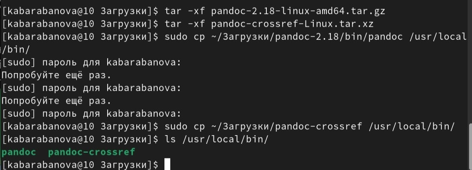

---
## Front matter
title: "Очёт по лабораторной работе №4"
subtitle: "Простейший вариант"
author: "Барабанова Кристина Андреевна"

## Generic otions
lang: ru-RU
toc-title: "Содержание"

## Bibliography
bibliography: bib/cite.bib
csl: pandoc/csl/gost-r-7-0-5-2008-numeric.csl

## Pdf output format
toc: true # Table of contents
toc-depth: 2
lof: true # List of figures
lot: true # List of tables
fontsize: 12pt
linestretch: 1.5
papersize: a4
documentclass: scrreprt
## I18n polyglossia
polyglossia-lang:
  name: russian
  options:
	- spelling=modern
	- babelshorthands=true
polyglossia-otherlangs:
  name: english
## I18n babel
babel-lang: russian
babel-otherlangs: english
## Fonts
mainfont: PT Serif
romanfont: PT Serif
sansfont: PT Sans
monofont: PT Mono
mainfontoptions: Ligatures=TeX
romanfontoptions: Ligatures=TeX
sansfontoptions: Ligatures=TeX,Scale=MatchLowercase
monofontoptions: Scale=MatchLowercase,Scale=0.9
## Biblatex
biblatex: true
biblio-style: "gost-numeric"
biblatexoptions:
  - parentracker=true
  - backend=biber
  - hyperref=auto
  - language=auto
  - autolang=other*
  - citestyle=gost-numeric
## Pandoc-crossref LaTeX customization
figureTitle: "Рис."
tableTitle: "Таблица"
listingTitle: "Листинг"
lofTitle: "Список иллюстраций"
lotTitle: "Список таблиц"
lolTitle: "Листинги"
## Misc options
indent: true
header-includes:
  - \usepackage{indentfirst}
  - \usepackage{float} # keep figures where there are in the text
  - \floatplacement{figure}{H} # keep figures where there are in the text
---

# Цель работы

Целью работы является освоение процедуры оформления отчетов с помощью
легковесного языка разметки Markdown.

# Выполнение лабораторной работы

## Установка TeX Live

1. На странице официального сайта TeX Live https://www.tug.org/texlive/acqu
ire-netinstall.html скачала архив install-tl-unx.tar.gz. (рис. [-@fig:001])

{ #fig:001 width=70% }

2. Распаковала архив, перешла в распакованную папку, запустила скрипт install-tl c root правами. (рис. [-@fig:002])

{ #fig:002 width=70% }

## Установка Pandoc и pandoc-crossref

1. Скачала архивы с исходными файлами. 
Скачала архив pandoc (рис. [-@fig:003])

{ #fig:003 width=70% }

Скачала архив pandoc-crossref (рис. [-@fig:004])

{ #fig:004 width=70% }

2. Распаковала архивы, скопировала файлы pandoc и pandoc-crossref в каталог /usr/local/bin/, с помощью команды ls проверила корректность выполненных действий. (рис. [-@fig:005])

{ #fig:005 width=70% }

##  Порядок выполнения лабораторной работы

1. Открыла терминал, перешла в каталог курса сформированный при выполнении лабораторной работы №3, обновила локальный репозиторий, скачав изменения из удаленного репозитория с помощью команды git pull, перейдите в каталог с шаблоном отчета по лабораторной работе № 4, провела компиляцию шаблона с использованием Makefile, удалила полученный файлы с использованием Makefile. (рис. [-@fig:006])

{ #fig:006 width=70% }

# Выводы

Я освоила процедуры оформления отчетов с помощью
легковесного языка разметки Markdown.

